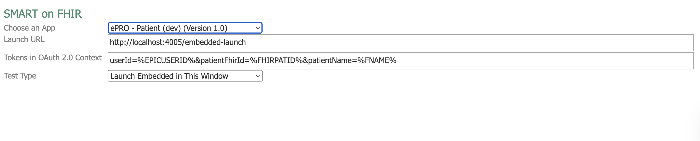

# Epic OAuth Script

This script provides a simple way to perform OAuth 2.0 authentication with Epic's FHIR API. It is intended for
developers who want to test or demonstrate the Epic OAuth flow, retrieve access tokens, and view user profile
information.

## Purpose

- Demonstrates the OAuth 2.0 Authorization Code flow with Epic's FHIR endpoints.
- Fetches and displays access tokens and user profile information after successful authentication.
- Useful for development, testing, and learning how Epic's OAuth process works.

## Prerequisites

- Node (v16 or higher recommended)
- An Epic client ID and redirect URI registered with [Vendor Services](https://vendorservices.epic.com/).
- A VPN connection

## Installation

1. Clone this repository.
2. Install dependencies:
   ```bash
   yarn
   ```

## Configuration

Set the following environment variables in .env as needed:

- `EPIC_BASE_URL`: The base URL for the Epic FHIR server. The default value is the sandbox URL.
- `CLIENT_ID`: Your Epic FHIR client ID
- `CLIENT_SECRET`: (Optional) Your Epic FHIR client secret (leave blank if not required)
- `INITIALIZATION_PATH`: The route that initializes authorization with Epic.
- `SCOPE`: The scope of access you are requesting (defaults to `openid profile fhirUser`). `openid` is required, and
  `fhirUser` is recommended to access the user's FHIR endpoint to retrieve their profile. `profile` will provide the
  user's `preferred_username` (typically their t-id). You can add additional scopes as needed, separated by spaces. 
  `launch` will automatically be added to the scope if the initialization request comes as an embedded launch request from Epic.
- `HOST`: The host the local server will run on (defaults to `localhost`)
- `PORT`: The port the local server will run on (defaults to `4005`)
- `CALLBACK_PATH`: The path for the callback URL (defaults to `/oauth/mychart/callback`). The combined `HOST`, `PORT`,
  and `CALLBACK_PATH` will form the full callback URL.
- `LOG_LEVEL`: Defaults to `info`. You can set it to `debug` for more detailed logging. Or `error` to only log errors.
- `FETCH_PROFILE`: (Optional) Defaults to `true`. Set to `false` if you do not want to fetch the user profile after
  authentication.
- `SHOW_TOKEN_IN_BROWSER`: (Optional) Defaults to `false` to avoid accidentally displaying tokens. Set to `true` to
  display the access token in the browser after authentication.
  You can set these by copying the `.env.example` file and updating as needed.
- `FETCH_ADDITIONAL_RESOURCES`: (Optional) Defaults to `false`. Set to `true` if you want to make additional requests to
  Epic using the access token obtained after successful authentication with Epic. Extra requests can be defined in the
  `test-requests.json` file. Provide the resource name and search params for all additional requests (see below for more
  info).
  Individual responses will be timestamped and stored in the responses directory.
- `OPEN_BROWSER`: (Optional) defaults to `true`. This opens a browser window to the script's "home" page after the
  server starts. It can be helpful to set this to `false` when testing Embedded launch to avoid opening extra browser
  tabs.

### Test Requests

When `FETCH_ADDITIONAL_RESOURCES` is set to `true`, the script will attempt to fetch all the resources defined in
`test-requests.json`. This file contains a list of resource in the following format:

```json
[
  {
    "resource": "Patient",
    "params": {
      "identifier": "<patient FHIR ID>"
    }
  },
  {
    "resource": "Appointment",
    "params": {
      "patient": "<patient FHIR ID>",
      "status": "arrived",
      "date": "YYYY-MM-DD"
    }
  }
]
```

The example above would make one request to
the [patient resource endpoint](https://fhir.epic.com/Specifications?api=932) to fetch the patient with the provided
identifier. The response will be stored in `responses/<timestamp>-Patient.json`. Then it would fetch Appointments for
the specified patient on the specified day, where the status is "arrived." That response will be stored in
`responses/<timestamp>-Appointment.json`.

## Usage

1. Start the script:
   ```bash
   yarn run start
   ```
2. The script will open a browser window. The default home page will have a button that can be pressed to initiate
   authorization.
3. Clicking the 'Authenticate with Epic' button will redirect to the Epic MyChart login form.
4. After successful authentication, a success message will be shown in the browser. If configured to do so, the browser
   will display the access token and user profile information as well. Note that the user profile is fetched using the
   `fhirUser` scope, which provides a URL directly to the user's FHIR endpoint.
5. token.json file will be created in the current directory containing the auth response, including the access token
   and id token.
6. If `FETCH_ADITIONAL_RESOURCES` is true and there are requests defined in `test-requests.json`, those requests will be
   made using the access token received in earlier steps. The responses will be stored in the responses directory.

## Embedded Launch Mode

1. Create a new Embedded Launch Simulation in Vendor Services. This is found under "Find Resources" > "Embedded
   Simulator." Click on "SMART on FHIR" to create a new simulation. Choose the app you want to test, and set the
   "Launch URL" to the combined `http://HOST:PORT/INITIALIZATION_PATH` you configured in your `.env` file. Add any
   tokens you want to collect as part of the authentication flow. Select Launch Type "Launch Embedded in This Window"
   (or whichever option you wish to test). See example below:
   
2. Click the "Save" button to create the simulation.
3. (Optional) You may wish to set the environment variable `OPEN_BROWSER` to `false` to avoid opening an extra browser
   tab when starting the script.
4. Start the script:
   ```bash
   yarn run start
   ```
5. Click "Run Test" in your simulation or click the test name in the list of simulations on the left of the screen to
   start the simulation.
   You may be asked to look up a patient before running the simulation.
6. Starting the simulation will force a redirect to the initialization path you configured in your `.env` file.
   This will start the OAuth flow, and you will be prompted to log in and authorize the app with Epic.
7. After successful authentication, a success message will be shown in the browser. If configured to do so, the browser
   will display the access token and user profile information as well. Note that the user profile is fetched using the
   `fhirUser` scope, which provides a URL directly to the user's FHIR endpoint.
8. A token.json file will be created in the current directory containing the auth response, including the access token
   and id token.
9. If `FETCH_ADITIONAL_RESOURCES` is true and there are requests defined in `test-requests.json`, those requests will be
   made using the access token received in earlier steps. The responses will be stored in the responses directory.

## Implementation Notes

An application that wishes to authenticate with Epic needs to listen to at least 2 endpoints. The endpoints are:

- The URL that will initialize the OAuth flow, which will redirect the user to Epic's authorization server. This can be
  the same for both standalone and embedded launch, or can be split into two separate endpoints if there are significant
  differences in how the application plans to handle each auth case.
- The callback URL that Epic will redirect to after successful authentication.

In the case of standalone launch, typically, a button or link in your application will redirect the user to the OAuth
initialization URL, which will start the OAuth flow. After the user logs in and authorizes the app, they will be
redirected back to the callback URL with an authorization code. The application can then exchange this code for an
access token and ID token by making a request to the Epic token endpoint. The access token can then be used to make
authenticated requests to the FHIR API.

In the case of embedded launch, an endpoint is needed to capture the request Epic sends to launch the application in an
embedded context. This endpoint will initialize the OAuth flow. The user will be directed to Epic to authorize the app,
then redirected back to the callback URL with an authorization code. The application can then exchange this code for an
access token and ID token by making a request to the Epic token endpoint. The access token can then be used to make
authenticated requests to the FHIR API.

The main difference between standalone and embedded launch is that there are two additional parameters required
for the initial authorization request (`aud` and `launch`). When Epic sends a request for embedded launch, it will
also send `launch` and `iss` parameters. `launch` will be included as `launch` in the initial authorization request and
`iss` will be included as `aud`.

## Security Note

- This script is for development and demonstration purposes only. Do not use it in production environments.
- Never share your client secrets or access tokens.
- Never commit the token.json file that is generated after authentication, as it contains sensitive information.

## Troubleshooting 

If something isn't working as expected, check the following:

- VPN connection
- `EPIC_BASE_URL` points to the correct URL. If testing embedded launch, this likely needs to be the vendor services URL.
- Set `LOG_LEVEL` to `debug` to see more information ub the logs
